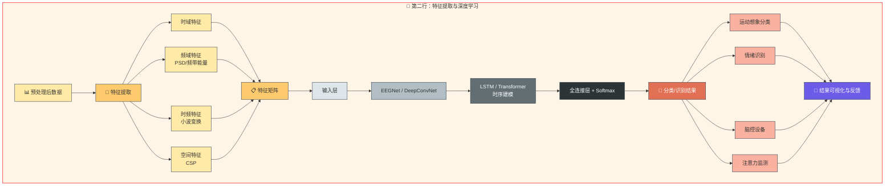

```mermaid
flowchart TB
    subgraph Row1 [🔬 第一行：信号采集与预处理]
        direction LR
        A[🧠 脑机采集设备<br>OpenBCI Cyton] --> B[🔌 BrainFlow<br>设备连接与流式传输]
        B --> C[📊 原始EEG数据流]
        C --> D1[创建Raw对象]
        D1 --> D2[设置Montage<br>电极定位]
        D2 --> D3[带通滤波<br>0.5-50Hz]
        D3 --> D4[陷波滤波<br>去除工频50Hz]
        D4 --> D5[伪迹去除<br>ICA/SSP]
        D5 --> D6[重参考<br>平均参考/Cz]
        D6 --> E[📈 预处理后数据<br>Epochs/分段]
    end


    style Row1 fill:#e8f4f8,stroke:#4ECDC4,stroke-width:2px,color:#333

    
    style A fill:#4ECDC4,stroke:#2c3e50,color:#fff
    style B fill:#45B7D1,stroke:#2c3e50,color:#fff
    style C fill:#74b9ff,stroke:#2c3e50,color:#fff
    style D1 fill:#96CEB4,stroke:#2c3e50,color:#333
    style D2 fill:#96CEB4,stroke:#2c3e50,color:#333
    style D3 fill:#96CEB4,stroke:#2c3e50,color:#333
    style D4 fill:#96CEB4,stroke:#2c3e50,color:#333
    style D5 fill:#96CEB4,stroke:#2c3e50,color:#333
    style D6 fill:#96CEB4,stroke:#2c3e50,color:#333
    style E fill:#55efc4,stroke:#2c3e50,color:#333
    
```

```mermaid
flowchart TB
    subgraph Row2 [🤖 第二行：特征提取与深度学习]
        direction LR
        F[📊 预处理后数据] --> G[🧬 特征提取]
        G --> G1[时域特征]
        G --> G2[频域特征<br>PSD/频带能量]
        G --> G3[时频特征<br>小波变换]
        G --> G4[空间特征<br>CSP]
        
        G1 & G2 & G3 & G4 --> H[📋 特征矩阵]
        
        H --> I1[输入层]
        I1 --> I2[EEGNet / DeepConvNet]
        I2 --> I3[LSTM / Transformer<br>时序建模]
        I3 --> I4[全连接层 + Softmax]
        I4 --> J[🎯 分类/识别结果]
        
        J --> K1[运动想象分类]
        J --> K2[情绪识别]
        J --> K3[脑控设备]
        J --> K4[注意力监测]
        
        K1 & K2 & K3 & K4 --> L[📱 结果可视化与反馈]
    end


    style Row2 fill:#fef5e7,stroke:#FF6B6B,stroke-width:2px,color:#333
    
    
    style F fill:#ffeaa7,stroke:#2c3e50,color:#333
    style G fill:#fdcb6e,stroke:#2c3e50,color:#333
    style G1 fill:#ffeaa7,stroke:#2c3e50,color:#333
    style G2 fill:#ffeaa7,stroke:#2c3e50,color:#333
    style G3 fill:#ffeaa7,stroke:#2c3e50,color:#333
    style G4 fill:#ffeaa7,stroke:#2c3e50,color:#333
    style H fill:#fdcb6e,stroke:#2c3e50,color:#333
    
    style I1 fill:#dfe6e9,stroke:#2c3e50,color:#333
    style I2 fill:#b2bec3,stroke:#2c3e50,color:#333
    style I3 fill:#636e72,stroke:#2c3e50,color:#fff
    style I4 fill:#2d3436,stroke:#2c3e50,color:#fff
    style J fill:#e17055,stroke:#2c3e50,color:#fff
    
    style K1 fill:#fab1a0,stroke:#2c3e50,color:#333
    style K2 fill:#fab1a0,stroke:#2c3e50,color:#333
    style K3 fill:#fab1a0,stroke:#2c3e50,color:#333
    style K4 fill:#fab1a0,stroke:#2c3e50,color:#333
    style L fill:#6c5ce7,stroke:#2c3e50,color:#fff
```
