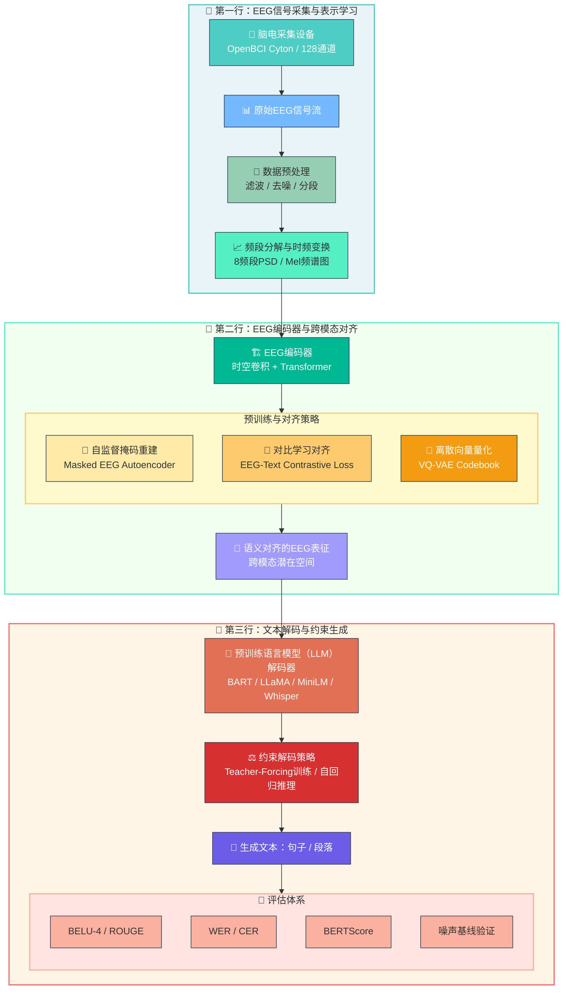

```mermaid
flowchart TB
    subgraph Row1 [🔬 第一行：EEG信号采集与表示学习]
        direction LR
        A[🧠 脑电采集设备<br>OpenBCI Cyton / 128通道] --> B[📊 原始EEG信号流]
        B --> C[🔌 数据预处理<br>滤波 / 去噪 / 分段]
        C --> D[📈 频段分解与时频变换<br>8频段PSD / Mel频谱图]
    end

    subgraph Row2 [🧬 第二行：EEG编码器与跨模态对齐]
        direction LR
        D --> E[🏗️ EEG编码器<br>时空卷积 + Transformer]
        
        subgraph Pretrain [预训练与对齐策略]
            direction TB
            F1[🔄 自监督掩码重建<br>Masked EEG Autoencoder]
            F2[🎯 对比学习对齐<br>EEG-Text Contrastive Loss]
            F3[🧊 离散向量量化<br>VQ-VAE Codebook]
        end
        
        E --> Pretrain
        Pretrain --> G[🌉 语义对齐的EEG表征<br>跨模态潜在空间]
    end

    subgraph Row3 [🤖 第三行：文本解码与约束生成]
        direction LR
        G --> H[📝 预训练语言模型（LLM）解码器<br>BART / LLaMA / MiniLM / Whisper]
        H --> I[⚖️ 约束解码策略<br>Teacher-Forcing训练 / 自回归推理]
        I --> J[📄 生成文本：句子 / 段落]
        
        subgraph Eval [📐 评估体系]
            direction TB
            K1[BELU-4 / ROUGE]
            K2[WER / CER]
            K3[BERTScore]
            K4[噪声基线验证]
        end
        
        J --> Eval
    end

    style Row1 fill:#e8f4f8,stroke:#4ECDC4,stroke-width:2px,color:#333
    style Row2 fill:#f0fff0,stroke:#55efc4,stroke-width:2px,color:#333
    style Row3 fill:#fef5e7,stroke:#FF6B6B,stroke-width:2px,color:#333
    style Pretrain fill:#fffacd,stroke:#fdcb6e,stroke-width:2px,color:#333
    style Eval fill:#ffe4e1,stroke:#fab1a0,stroke-width:2px,color:#333
    
    style A fill:#4ECDC4,stroke:#2c3e50,color:#fff
    style B fill:#74b9ff,stroke:#2c3e50,color:#fff
    style C fill:#96CEB4,stroke:#2c3e50,color:#333
    style D fill:#55efc4,stroke:#2c3e50,color:#333
    style E fill:#00b894,stroke:#2c3e50,color:#fff
    style F1 fill:#ffeaa7,stroke:#2c3e50,color:#333
    style F2 fill:#fdcb6e,stroke:#2c3e50,color:#333
    style F3 fill:#f39c12,stroke:#2c3e50,color:#fff
    style G fill:#a29bfe,stroke:#2c3e50,color:#fff
    style H fill:#e17055,stroke:#2c3e50,color:#fff
    style I fill:#d63031,stroke:#2c3e50,color:#fff
    style J fill:#6c5ce7,stroke:#2c3e50,color:#fff
    style K1 fill:#fab1a0,stroke:#2c3e50,color:#333
    style K2 fill:#fab1a0,stroke:#2c3e50,color:#333
    style K3 fill:#fab1a0,stroke:#2c3e50,color:#333
    style K4 fill:#fab1a0,stroke:#2c3e50,color:#333
```